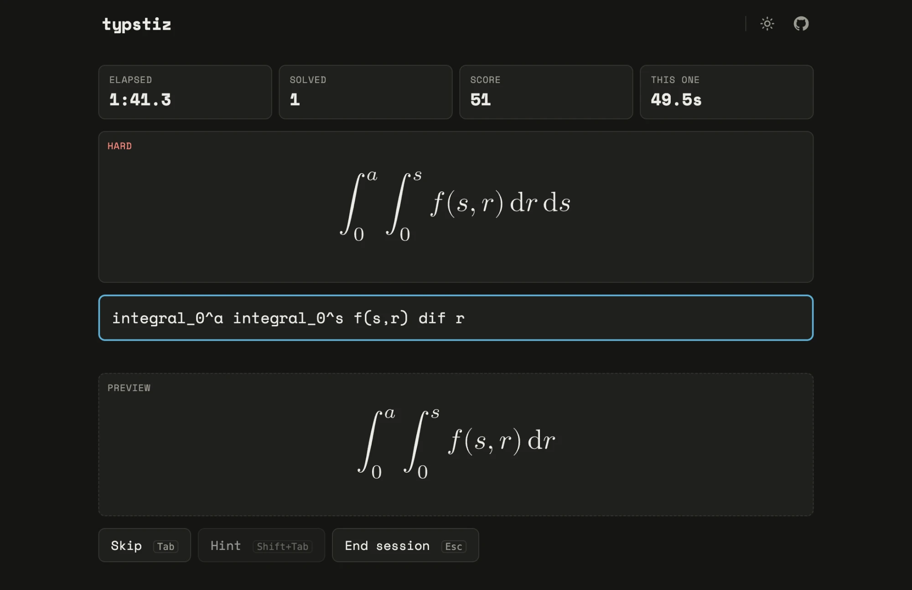

<h1 align="center">Typstiz</h1>

**A [Typst](https://typst.app) speed-typesetting game.** A rendered expression appears. Type the 
source that reproduces it, as fast as you can.

<p align="center">
  
</p>

Typstiz doesn't compare text, it compares what gets drawn. `a/b` and `frac(a, b)` produce the same
fraction, so both count. Write it your way.

Everything runs in your browser. No account, no backend, nothing to install.

## How to play

1. Pick a mode, a difficulty and a duration on the start screen.
2. A target expression is shown. Type Typst source in the input; a live preview renders as you type.
3. The moment your render matches the target, you score and the next expression appears.

| Key | Action |
|---|---|
| `Tab` | Skip the current expression (scores 0) |
| `Shift+Tab` | Reveal a hint for a symbol, at a small cost in score |
| `Esc` | End the session |

- **Timed run:** solve as many expressions as you can before the clock runs out.
- **Zen:** no clock, quit whenever you like.
- **Difficulty:** easy, medium, hard, or random. Harder tiers bring integrals, matrices, sums and
  nested structures.
- Faster solves score more. Your best runs are kept in your browser's local storage.

New to Typst math? The [math reference](https://typst.app/docs/reference/math/) lists every symbol
and function.

<details>
<summary>Run it locally</summary>

```bash
npm install
npm run dev        # http://localhost:5173
npm test           # Vitest, including the real-WASM equivalence and generator compile suites
npm run typecheck
npm run lint
npm run build      # static bundle in dist/
```

</details>

<details>
<summary>Deploy</summary>

`npm run build` outputs a fully static site in `dist/` that works from any path (`base: './'`).

| Host | Settings |
|---|---|
| Cloudflare Pages | Build command `npm run build`, output `dist`. Cache headers come from `public/_headers`. |
| Netlify | Same as above; `_headers` is honored. |
| Vercel | Framework preset "Vite"; cache headers come from `vercel.json`. |
| Docker / Coolify | `Dockerfile` builds the bundle and serves it with nginx on port 80 (config in `deploy/nginx.conf`, same cache headers, assets precompressed). Coolify: build pack "Dockerfile", "Ports Exposes" and healthcheck port both `80` (not the default 3000), auto deploy set to "Manual deployments only". CI triggers the deploy on `main` via the `COOLIFY_WEBHOOK` and `COOLIFY_TOKEN` repo secrets. |

Notes:
- The Typst compiler WASM is ~28 MB (~11 MB gzipped). It has a content-hashed URL and is served
  with `immutable` caching, so it downloads once. It loads in parallel with the start screen.
- The host must serve `.wasm` as `application/wasm` (all the hosts above do) for streaming compilation.
- Fonts (New Computer Modern, from `typst/typst-assets` v0.13.1) are self-hosted in `public/fonts/`
  so every player renders with identical glyphs. The engine self-checks fonts at startup and
  shows an error instead of silently comparing broken renders.

</details>

<details>
<summary>Under the hood</summary>

- Answers are compiled in-browser with [typst.ts](https://github.com/Myriad-Dreamin/typst.ts)
  (WASM) and compared by rendered output.
- Expressions come from a seeded template generator, so runs are reproducible.
- Built with React, TypeScript, Vite and Zustand.
- Product spec: [spec.md](spec.md). Implementation plan and status: [PLAN.md](PLAN.md).

</details>

## Credits

Inspired by [TypeLaTeX](https://www.typelatex.com/) and [Texnique](https://texnique.xyz/). Typstiz brings the same
game to [Typst](https://typst.app).

## License

[MIT](LICENSE). The bundled New Computer Modern fonts in `public/fonts/` keep their own license
(GUST Font License).
